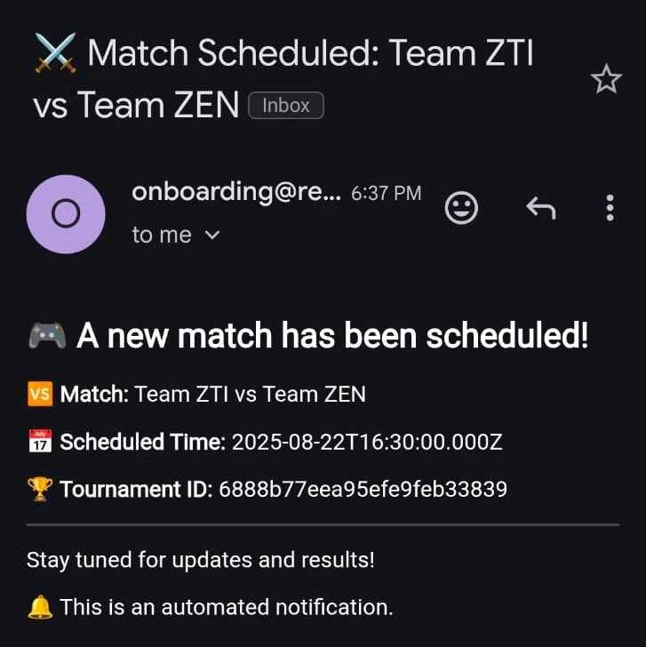

# 🎮 Esports Tournament Microservices Platform

A scalable, microservices-driven backend for managing esports tournaments and matches. Built using Node.js, Express, MongoDB, Docker, and RabbitMQ — with real-time email notifications using Resend.

---

## 🚀 Features

### 🧩 Microservice Architecture
- **Modular services** for tournament management, match scheduling, notifications, and users
- **Independent scalability** of services using Docker Compose

### 🎮 Tournament Management
- Create, update, and manage esports tournaments via the `tournament-service`
- Supports linking with organizers (user IDs)

### 🆚 Match Scheduling
- Schedule matches with team names and time via the `match-service`
- Automatically associates with tournaments

### 📬 Email Notifications
- Sends real-time emails when a **tournament** or **match** is created
- Integrates with **Resend API**
- Uses `notification-service` to decouple notification logic from core business services

  
  

### 📦 RabbitMQ Messaging
- **Asynchronous event-driven communication** between services
- Events like `tournament_created`, `match_created` trigger mail notifications

  

### 🐳 Fully Dockerized
- Each service runs as an isolated container
- Uses Docker Compose for easy orchestration

### 📁 MongoDB for Persistence
- Each service communicates with MongoDB for storing structured data

---

## 🧱 Tech Stack

| Tool/Service      | Purpose                          |
|-------------------|----------------------------------|
| **Node.js**       | JavaScript runtime               |
| **Express.js**    | Backend HTTP framework           |
| **MongoDB**       | NoSQL database for persistence   |
| **RabbitMQ**      | Message broker for events        |
| **Docker**        | Containerization                 |
| **Docker Compose**| Service orchestration            |
| **Resend**        | Email delivery API               |
| **dotenv**        | Secure environment config        |

---

## 📂 Microservices Overview

| Service               | Port  | Role                                      |
|-----------------------|-------|-------------------------------------------|
| `user-service`        | 3001  | Basic user info / ID mapping              |
| `tournament-service`  | 3002  | Create/manage tournaments                 |
| `match-service`       | 3003  | Schedule matches linked to tournaments    |
| `notification-service`| 3004  | Sends emails on tournament/match creation |
| `mongo`               | 27017 | Central MongoDB instance                  |
| `rabbitmq`            | 5672  | Message broker & queue manager            |

---

## 📩 Sample Notification Flow

1. A **POST request** is made to create a tournament or match.
2. The relevant service sends an event to RabbitMQ (`tournament_created` or `match_created`).
3. `notification-service` listens to that event and sends an email via **Resend**.

---
